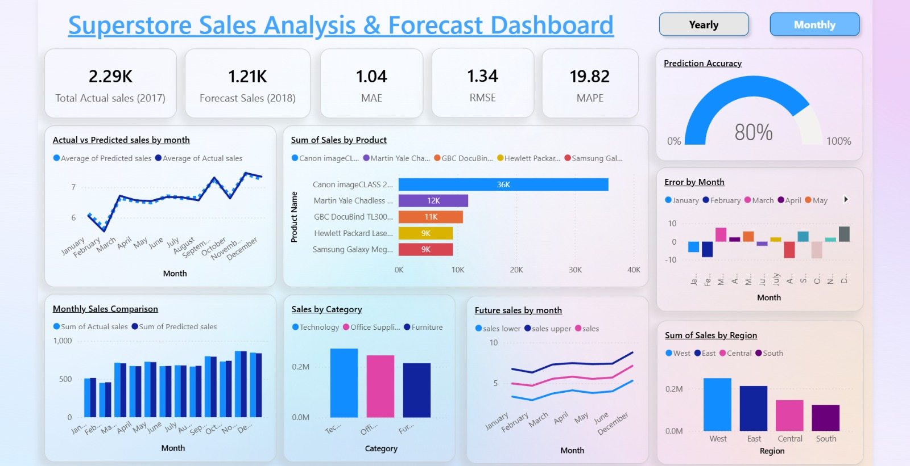

# 📊 Sales Forecasting Dashboard  

This project was built as part of my **Machine Learning Internship with Future Interns**. The goal was to forecast sales trends and build an **interactive dashboard** for business insights.  

## 🚀 Project Overview  
- Developed a **time series forecasting model** using **Facebook Prophet**  
- Visualized results and KPIs with **Power BI**  
- Analyzed past trends and predicted future sales  
- Evaluated model performance using **MAE, RMSE, and MAPE**  

## 📂 Features  
✅ Forecasting daily sales with confidence intervals  
✅ Actual vs Forecasted trend visualization  
✅ KPI cards for Actual & Predicted Sales  
✅ Error Analysis (Residuals)  
✅ Category-wise and sub-category-wise insights  
✅ Interactive dashboard filters  

## 🛠️ Tech Stack  
- **Python** (Pandas, Prophet, NumPy, Matplotlib)  
- **Power BI** (Data Visualization & KPI Dashboards)  

## 📈 Model Performance  
- **MAE:** 1.04  
- **RMSE:** 1.34  
- **MAPE:** 19.82%  
- **Prediction Accuracy Gauge** added in Power BI  

📸 Dashboard Preview  

### Monthly Analysis  
  

### Yearly Analysis  
  

## 🔗 Links  
- 📂 [Dataset](https://www.kaggle.com/datasets/vivek468/superstore-dataset-final)  
- 💻 [Code Notebook](https://colab.research.google.com/drive/1yJr0z0XoNETChb4C5GRnP2IUq8OP8dxz?usp=sharing)  
- 📊 [Dashboard File](https://github.com/vivek-boini/FUTURE_ML_01/blob/main/ML-task1.pbix)  

## 🏆 Internship Task  
This project is part of **Task 1** under my internship at **Future Interns**, focusing on **Machine Learning & Time Series Forecasting**.  
